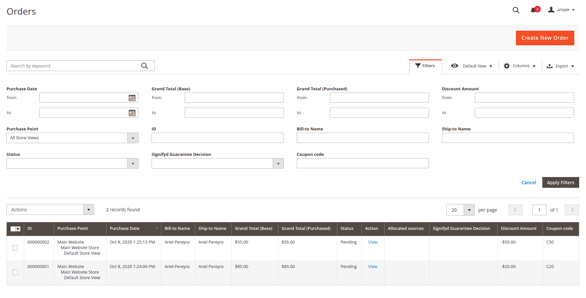
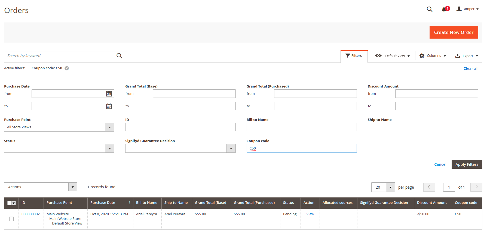
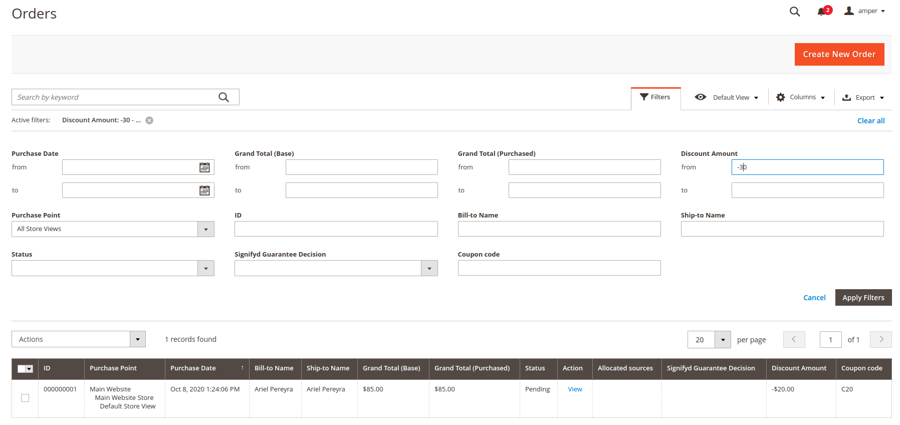
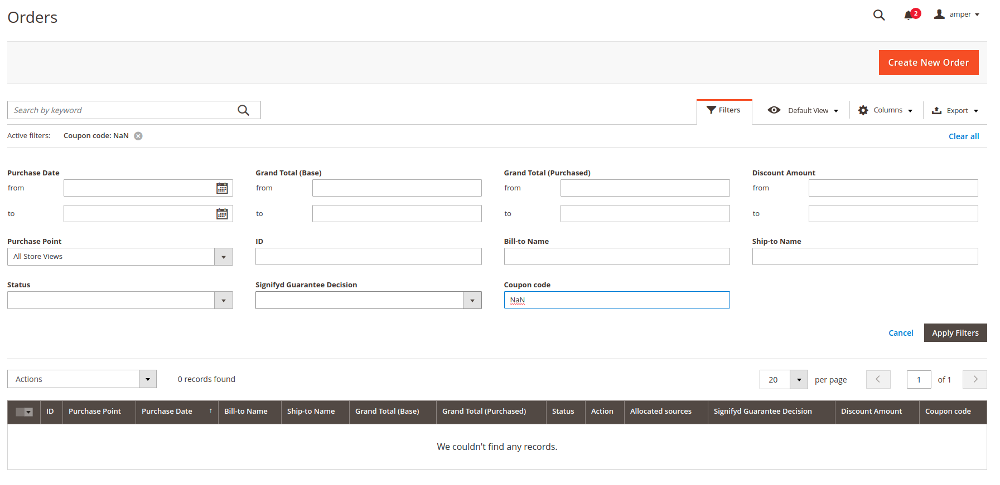

# Admin Sales Order Grid

This is basically a brand new module developed based off Magento 2.3.5 p2 version, to get as reference for potential needs.

# Purpose

Add coupon_code and discount amount to admin's sales_order_grid. One should be able to add and remove the new columns from the grid and also filter by them.

# Code Explanation

It is divided in two parts, at first, i extended the OrderGridCollection resource model in order to get what i need to show joining the sales order table (in this case, as the coupon code and discount amount are fields of the sales_order table, i only added them to the main table). 

The second part is where we add the ui_component that the grid shows on sales_order_grid.xml, and where we set up the filters, in this case, the discount amount is a price range filter, and the coupon code, is a text one.

After that, we add all those changes through dependency injection, in the etc/di.xml file.

# Screenshots / Usability

Log into your admin panel and go to Sales > Orders to get the grid.

